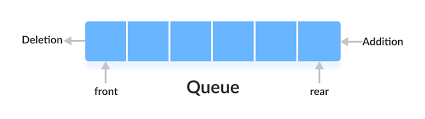

Queue Interface

The Queue Interface is present in java.util package and extends the Collection interface is used to hold the elements about to be processed in FIFO(First In First Out) order. It is an ordered list of objects with its use limited to inserting elements at the end of the list and deleting elements from the start of the list, (i.e.), it follows the FIFO or the First-In-First-Out principle.

    Queue<Integer> queue=new LinkedList<>();

Operations in queue:

offer() : Used to insert an element into rear end of the queue.

poll() : Used to remove front element of the queue

peek() : User to display first element that need to remove next

Note: There are alternative methods that similar to above methods in the queue,

add() : This will add an element to the queue and if the task is failed it will throw an exception,
but in the offer() method if the task is failed it will return null.

remove() : This will remove an element and if the queue is empty it will throw an exception but poll method will return null.

element() : This will display the first element and if the queue is empty it will throw an exception but in peek() method if the queue is empty it will return null.