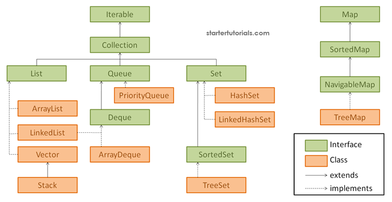

Collection Framework:

(Content credit: https://www.startertutorials.com/corejava/introduction-java-collections-framework.html)

In order to write efficient programs you need to know how to work with a data structure. A data structure is a entity which contains a group of data organized in some manner. Examples of popular data structures are arrays, stacks, queues, linked lists, trees, etc.

Java provides many data structures. The data structure framework or library provided by Java is known as the Java Collections Framework (JCF). Java defines a collection as an object that represents a group of objects.