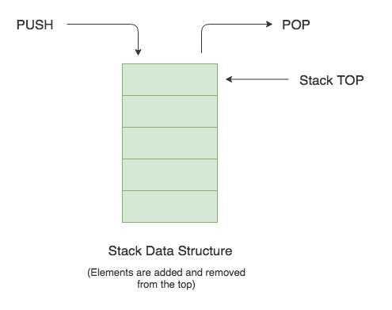

Stack

Stack is a java class implementing list interface which is implementing collection interface which follows LIFO (Last In First Out) order.

Operations in Stack:

push(): Push method is used to insert an element into the stack.

pop(): Pop method is used to remove the top element from the stack.

peek(): peek method is used to print the top element of the stack.